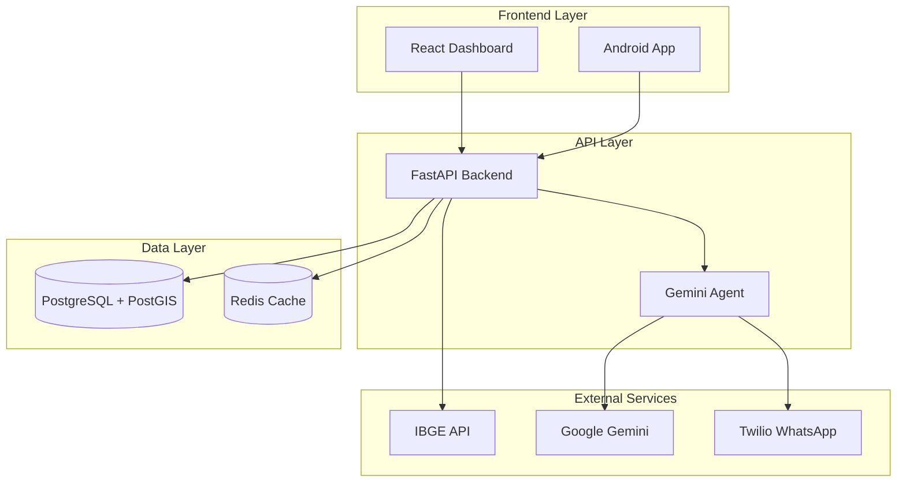

# Arquitetura do Sistema - Tá na Mão

## Visão Geral

O Tá na Mão é uma plataforma multi-camadas que integra dados de benefícios sociais brasileiros com um agente de IA conversacional.

## Diagrama de Arquitetura



## Componentes Principais

### Backend (FastAPI)

**Responsabilidades:**
- API REST para dados de benefícios
- Agregações e análises
- Integração com agente IA
- Gerenciamento de sessões

**Estrutura:**
```
backend/
├── app/
│   ├── core/          # Logging estruturado, exceptions, utilities
│   ├── models/        # SQLAlchemy models (async)
│   ├── routers/       # API endpoints (100% async)
│   ├── agent/         # IA agent implementation
│   ├── jobs/          # Data ingestion scripts
│   └── middleware/    # Metrics (Prometheus), auth, etc.
├── alembic/           # Database migrations
└── tests/             # Test suite (pytest, async)
```

**Características:**
- **SQLAlchemy Async**: Todas as queries são assíncronas para melhor performance
- **Cache Redis**: Cache distribuído para queries frequentes
- **Logging Estruturado**: Logs JSON com structlog
- **Métricas**: Prometheus metrics middleware

### Frontend (React + TypeScript)

**Responsabilidades:**
- Dashboard interativo
- Visualização de mapas
- Gráficos e estatísticas
- Interface de chat

**Tecnologias:**
- React 18
- TypeScript
- Vite
- TailwindCSS
- Leaflet (mapas)
- Recharts (gráficos)
- React Query (data fetching)

### Android App (Kotlin)

**Responsabilidades:**
- Interface mobile nativa
- Chat com agente IA
- Notificações push
- Cache offline

**Arquitetura:**
- MVVM + Clean Architecture
- Jetpack Compose
- Hilt (DI)
- Room (cache local)

## Fluxo de Dados

### 1. Ingestão de Dados

```
Fontes Externas → Jobs de Ingestão → PostgreSQL
```

**Fontes:**
- Portal da Transparência
- OpenDataSUS
- ANEEL
- IBGE

### 2. Consulta de Dados

```
Cliente → API → Cache (Redis) → PostgreSQL → Resposta
```

### 3. Chat com Agente

```
Usuário → API → Gemini Agent → Tools → Resposta
```

**Tools disponíveis:**
- Validação de CPF
- Busca de CEP
- Consulta de benefícios
- Geração de checklist
- Busca de CRAS/Farmácias
- Processamento de receitas

## Banco de Dados

### Modelos Principais

- **State**: Estados brasileiros
- **Municipality**: Municípios (com geometria PostGIS)
- **Program**: Programas sociais
- **BeneficiaryData**: Dados agregados por município/programa/mês
- **CadUnicoData**: Dados demográficos do CadÚnico
- **Pedido**: Pedidos de medicamentos
- **Beneficiario**: Beneficiários (com hash de CPF)

### Índices

- `municipalities.ibge_code` (único)
- `beneficiary_data(municipality_id, program_id, reference_date)`
- `municipalities.geometry` (GIST para PostGIS)

## Cache Strategy

**Redis é usado para:**
- GeoJSON de estados/municípios (TTL: 24h)
- Agregações nacionais (TTL: 1h)
- Buscas de municípios (TTL: 30min)
- Sessões do agente IA

## Segurança

### Autenticação
- JWT para endpoints admin (planejado)
- Rate limiting em endpoints públicos

### Privacidade
- CPFs são hasheados (SHA-256)
- Dados pessoais não são armazenados em texto plano
- LGPD compliant

## Monitoramento

### Métricas (Prometheus)
- Requisições HTTP (total, duração)
- Queries de banco de dados
- Requisições ativas
- Health checks

### Logging
- Estruturado (JSON em produção)
- Contexto de requisição (request ID)
- Níveis: DEBUG, INFO, WARNING, ERROR

### Health Checks
- `/health`: Status geral
- `/metrics`: Métricas Prometheus

## Escalabilidade

### Horizontal Scaling
- API stateless (pode rodar múltiplas instâncias)
- Redis compartilhado
- PostgreSQL com replicação (planejado)

### Otimizações
- Cache agressivo
- Índices de banco de dados
- Queries otimizadas
- Connection pooling

## Deploy

### Desenvolvimento
- Docker Compose local
- Hot reload habilitado
- Logs em console

### Produção
- Docker Compose ou Kubernetes
- Multi-stage builds
- Health checks
- Logs centralizados
- Métricas Prometheus

## Roadmap Técnico

### Fase 1 (Completa)
- ✅ Estrutura básica
- ✅ Ingestão de dados
- ✅ API REST
- ✅ Dashboard web
- ✅ App Android MVP
- ✅ Async SQLAlchemy (100% routers migrados)
- ✅ Testes em todas as plataformas
- ✅ CI/CD completo (GitHub Actions)
- ✅ Logging estruturado e métricas

### Fase 2 (Próxima)
- [ ] Autenticação JWT para endpoints admin
- [ ] Rate limiting
- [ ] Aumentar cobertura de testes (>70%)
- [ ] OpenTelemetry tracing

### Fase 3 (Futura)
- [ ] Kubernetes deployment
- [ ] Replicação de banco
- [ ] CDN para assets
- [ ] WebSockets para chat em tempo real
- [ ] PWA para frontend


